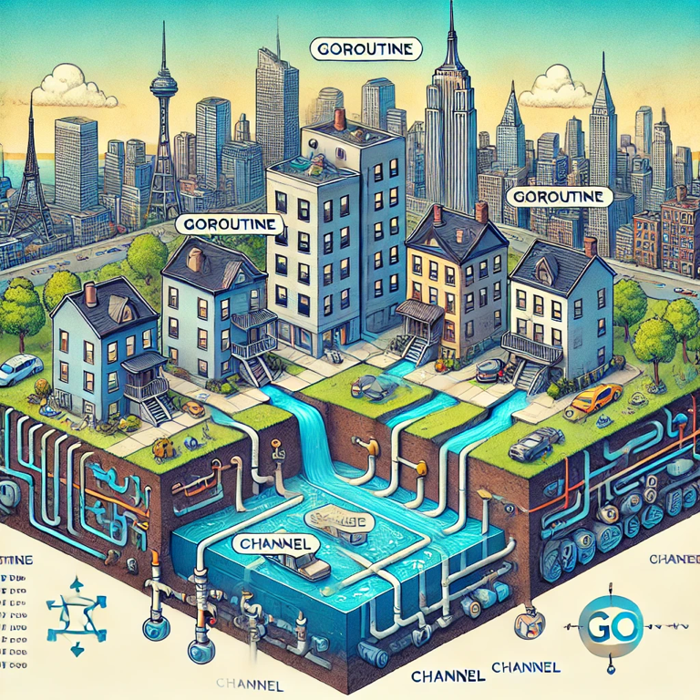

# Concurrencia en Golang con `Goroutines`

<p align="center">
  
</p>

## Objetivo del Taller

Este taller tiene como objetivo introducir a los participantes a los conceptos fundamentales de la concurrencia en
**Golang**, centrándose en el uso de **goroutines**. Al finalizar el taller, los participantes aprenderán a crear y
gestionar goroutines, utilizar canales para la comunicación entre ellas y aplicar buenas prácticas para escribir código
concurrente de manera eficiente.

## Tabla de Contenidos

1. [Marco Teórico](#marco-teórico)
    - [Concurrencia vs Paralelismo](#concurrencia-vs-paralelismo)
    - [Concurrencia en Golang](#concurrencia-en-golang)
    - [¿Qué son las Goroutines?](#qué-son-las-goroutines)
    - [Buenas Prácticas con Goroutines](#buenas-prácticas-con-goroutines)
2. [Ejemplos Prácticos](#ejemplos-prácticos)
    - [Ejemplo 1: Crear y ejecutar una Goroutine](#ejemplo-1-crear-y-ejecutar-una-goroutine)
    - [Ejemplo 2: Comunicación entre Goroutines con Canales](#ejemplo-2-comunicación-entre-goroutines-con-canales)
    - [Ejemplo 3: Worker Pool](#ejemplo-3-worker-pool)
3. [Ejercicios](#ejercicios)
    - [Ejercicio 1: Ejecutar funciones en paralelo](#ejercicio-1-ejecutar-funciones-en-paralelo)
    - [Ejercicio 2: Sincronización de Goroutines con Canales](#ejercicio-2-sincronización-de-goroutines-con-canales)
    - [Ejercicio 3: Implementar un Worker Pool](#ejercicio-3-implementar-un-worker-pool)
4. [Soluciones](#soluciones)

---

## Marco Teórico

### Concurrencia vs Paralelismo

- **Concurrencia**: Es la capacidad de manejar múltiples tareas que pueden ejecutarse de forma intercalada, pero no
  necesariamente al mismo tiempo.

- **Paralelismo**: Se refiere a ejecutar múltiples tareas de manera simultánea en diferentes núcleos de procesador.

#### Resumen:

- La concurrencia gestiona tareas múltiples de manera eficiente.
- El paralelismo ejecuta tareas simultáneamente en varios núcleos.

### Concurrencia en Golang

Golang tiene características incorporadas para soportar la concurrencia de manera simple y eficiente, siendo las más
importantes:

- **Goroutines**: Son funciones concurrentes ligeras.
- **Canales**: Permiten la comunicación segura entre goroutines.

### ¿Qué son las Goroutines?

Una **goroutine** es una función que se ejecuta de manera concurrente con otras goroutines y el flujo principal del
programa. Las goroutines son extremadamente ligeras en comparación con los hilos (threads) tradicionales y permiten un
alto grado de concurrencia.

#### Sintaxis básica:

```go
go functionName()
```

Al anteponer `go` a una función, ésta se ejecutará de manera concurrente como una goroutine. Esto permite que el flujo
principal del programa siga su ejecución mientras la goroutine se ejecuta en segundo plano.

#### ¿Cuándo utilizarlas?

- Para ejecutar tareas que no deben bloquear el flujo principal del programa.
- Para manejar tareas que pueden ejecutarse en paralelo, como la gestión de múltiples conexiones de red, la realización
  de tareas de entrada/salida o la ejecución de cálculos intensivos.

### Buenas Prácticas con Goroutines

1. **Gestionar el número de goroutines**: Aunque son ligeras, la creación de muchas goroutines sin control puede agotar
   los recursos del sistema. Utiliza mecanismos como **Worker Pools** para limitar el número de goroutines activas.
2. **Usar Canales para la sincronización**: Los canales son la forma más segura de coordinar goroutines y evitar
   condiciones de carrera. Utiliza canales para comunicar y sincronizar el trabajo entre varias goroutines.
3. **Evitar accesos simultáneos a memoria compartida**: Cuando varias goroutines acceden a los mismos datos compartidos,
   pueden ocurrir **condiciones de carrera** (race conditions). Utiliza canales o mecanismos de sincronización como
   `sync.Mutex` para proteger los accesos a la memoria compartida.
4. **Cerrar los canales cuando termines de usarlos**: Cuando una goroutine no necesita enviar más datos a través de un
   canal, es una buena práctica cerrarlo para evitar fugas de recursos.

---

## Ejemplos Prácticos

### Ejemplo 1: Crear y ejecutar una Goroutine

Este ejemplo muestra cómo ejecutar una función concurrentemente con una goroutine.

```go
package main

import (
	"fmt"
	"time"
)

func printNumbers() {
	for i := 1; i <= 5; i++ {
		fmt.Println(i)
		time.Sleep(500 * time.Millisecond) // Simula trabajo
	}
}

func main() {
	// Ejecutamos la función concurrentemente como una goroutine
	go printNumbers()

	// Esperamos a que la goroutine termine
	time.Sleep(3 * time.Second)
	fmt.Println("Main finished")
}
```

En este ejemplo, la función `printNumbers` se ejecuta concurrentemente con la goroutine y el programa principal continúa
su ejecución. La goroutine se ejecuta mientras el programa principal sigue su curso, pero si el programa principal
termina antes que la goroutine, la goroutine no tendrá oportunidad de completar su tarea. Por eso usamos `time.Sleep` en
`main` para darle tiempo a la goroutine a terminar.

### Ejemplo 2: Comunicación entre Goroutines con Canales

Los canales permiten que las goroutines se comuniquen entre sí de manera segura. En este ejemplo, una goroutine envía
mensajes a través de un canal y la función principal los recibe.

```go
package main

import (
	"fmt"
)

func sendMessages(ch chan string) {
	ch <- "Hola desde la goroutine"
	ch <- "Este es otro mensaje"
	close(ch) // Cerramos el canal después de enviar los mensajes
}

func main() {
	// Creamos un canal para enviar mensajes de tipo string
	messages := make(chan string)

	// Ejecutamos una goroutine que enviará mensajes al canal
	go sendMessages(messages)

	// Recibimos los mensajes del canal e imprimimos
	for msg := range messages {
		fmt.Println(msg)
	}
}
```

#### Explicación:

- La función `sendMessages` envía dos mensajes a través del canal `ch`. Una vez que todos los mensajes han sido
  enviados, el canal se cierra con `close(ch)` para indicar que no habrá más datos.
- En la función `main`, la goroutine envía los mensajes mientras la función principal los recibe a través del canal
  usando un bucle `for` que lee los valores hasta que el canal se cierra.

Este patrón permite una comunicación segura entre goroutines, asegurando que no haya condiciones de carrera o accesos
simultáneos no controlados.

### Ejemplo 3: Worker Pool

Un **Worker Pool** es un patrón común en programación concurrente donde múltiples goroutines (workers) procesan tareas
en paralelo. Este ejemplo muestra cómo crear un Worker Pool con 3 workers que procesan trabajos de manera concurrente.

```go
package main

import (
	"fmt"
	"time"
)

func worker(id int, jobs <-chan int, results chan<- int) {
	for j := range jobs {
		fmt.Printf("Worker %d procesando trabajo %d\n", id, j)
		time.Sleep(time.Second) // Simulamos procesamiento del trabajo
		results <- j * 2        // Enviamos el resultado al canal de resultados
	}
}

func main() {
	jobs := make(chan int, 100)
	results := make(chan int, 100)

	// Lanzamos 3 workers que ejecutarán la función worker en paralelo
	for w := 1; w <= 3; w++ {
		go worker(w, jobs, results)
	}

	// Enviamos 5 trabajos a los workers
	for j := 1; j <= 5; j++ {
		jobs <- j
	}
	close(jobs) // Cerramos el canal de trabajos cuando ya no hay más

	// Recibimos los resultados de los trabajos procesados
	for a := 1; a <= 5; a++ {
		fmt.Println("Resultado:", <-results)
	}
}
```

#### Explicación:

- **Workers**: Son goroutines que procesan trabajos recibidos a través del canal `jobs`. Cada worker toma un trabajo del
  canal, lo procesa (simulado con `time.Sleep`) y envía el resultado al canal `results`.
- **Canales**: El canal `jobs` es utilizado para enviar los trabajos a los workers, mientras que el canal `results` es
  utilizado para recibir los resultados procesados.
- **Cierre del canal**: Cerramos el canal `jobs` una vez que se han enviado todos los trabajos. Esto indica a los
  workers que ya no recibirán más trabajos y pueden terminar su ejecución.

Este patrón es útil para distribuir trabajos entre múltiples goroutines de manera eficiente y evitar crear goroutines
innecesarias.

---

## Ejercicios

### Ejercicio 1: Ejecutar funciones en paralelo


Escribe un programa que ejecute dos funciones en paralelo usando goroutines. Cada función debe imprimir un conjunto de
números.

#### Instrucciones:

1. Crea dos funciones que impriman números del 1 al 5.
2. Ejecuta ambas funciones en paralelo usando goroutines.
3. Asegúrate de que ambas funciones terminen su ejecución antes de que el programa finalice.

### Ejercicio 2: Sincronización de Goroutines con Canales



Modifica el ejercicio anterior para que las funciones envíen los números a un canal, y la función principal sea la
encargada de imprimir los números a medida que los recibe.

#### Instrucciones:

1. Crea un canal y usa las funciones para enviar los números a través del canal.
2. La función principal debe recibir los números del canal e imprimirlos.
3. Cierra el canal después de que todas las goroutines hayan terminado.

### Ejercicio 3: Implementar un Worker Pool


Crea un Worker Pool con 4 workers que procesen trabajos enviados a un canal. Cada worker debe simular que procesa el
trabajo durmiendo 1 segundo y luego enviar el resultado al canal de resultados.

#### Instrucciones:

1. Implementa 4 workers que procesen trabajos del canal `jobs`.
2. Envía 8 trabajos al canal `jobs`.
3. Recibe los resultados de los trabajos procesados en el canal `results`.

---

## Soluciones

### Solución 1: Ejecutar funciones en paralelo

```go
package main

import (
	"fmt"
	"time"
)

func printNumbers(label string) {
	for i := 1; i <= 5; i++ {
		fmt.Printf("%s: %d\n", label, i)
		time.Sleep(500 * time.Millisecond)
	}
}

func main() {
	go printNumbers("A")
	go printNumbers("B")

	// Esperamos a que las goroutines terminen
	time.Sleep(3 * time.Second)
	fmt.Println("Main finished")
}
```

### Solución 2: Sincronización de Goroutines con Canales

```go
package main

import "fmt"

func sendNumbers(label string, ch chan int) {
	for i := 1; i <= 5; i++ {
		ch <- i
	}
	close(ch) // Cerramos el canal cuando ya no hay más datos que enviar
}

func main() {
	ch := make(chan int)

	// Ejecutamos la goroutine que enviará números al canal
	go sendNumbers("A", ch)

	// Recibimos los números del canal e imprimimos
	for num := range ch {
		fmt.Println("Received:", num)
	}
}
```

#### Explicación:

- La función `sendNumbers` envía números del 1 al 5 a través del canal `ch`. Cuando todos los números han sido enviados,
  el canal se cierra con `close(ch)`, lo que indica que no habrá más valores que recibir.
- En la función `main`, se usa un bucle `for` que recibe los valores del canal e imprime cada número. El bucle continúa
  hasta que el canal se cierra.

Este enfoque permite que la función principal espere a que todos los números hayan sido procesados por las goroutines
sin que ocurra una condición de carrera o un acceso inseguro a los datos.

---

### Solución 3: Implementar un Worker Pool

```go
package main

import (
	"fmt"
	"time"
)

func worker(id int, jobs <-chan int, results chan<- int) {
	for j := range jobs {
		fmt.Printf("Worker %d procesando trabajo %d\n", id, j)
		time.Sleep(time.Second) // Simulamos procesamiento del trabajo
		results <- j * 2        // Enviamos el resultado al canal de resultados
	}
}

func main() {
	jobs := make(chan int, 100)
	results := make(chan int, 100)

	// Lanzamos 4 workers que ejecutarán la función worker en paralelo
	for w := 1; w <= 4; w++ {
		go worker(w, jobs, results)
	}

	// Enviamos 8 trabajos a los workers
	for j := 1; j <= 8; j++ {
		jobs <- j
	}
	close(jobs) // Cerramos el canal de trabajos cuando ya no hay más

	// Recibimos los resultados de los trabajos procesados
	for a := 1; a <= 8; a++ {
		fmt.Println("Resultado:", <-results)
	}
}
```

## Practiquemos más 🤓

### Fábrica de Robots Concurrente en Go


¡Bienvenido a la Fábrica de Robots! Eres el ingeniero encargado de diseñar un sistema concurrente para ensamblar robots
en una fábrica automatizada. La fábrica tiene varias estaciones de trabajo, cada una encargada de ensamblar una parte
del robot: cabeza, brazos, piernas y cuerpo. Las piezas se envían a un equipo de ensamblaje que las combina para formar
un robot completo. Todo debe coordinarse mediante goroutines y canales para garantizar que los robots se ensamblen de
manera eficiente y sin errores.

Tu objetivo es diseñar un sistema donde múltiples goroutines ensamblen robots en paralelo, utilizando un worker pool
para gestionar el ensamblaje de piezas, y canales para la comunicación entre las estaciones.

#### Objetivos:

    • Implementar goroutines que representen las estaciones de trabajo.
    • Usar canales para pasar las piezas entre las estaciones de trabajo y el equipo de ensamblaje.
    • Crear un worker pool que gestione el ensamblaje de los robots.
    • Asegurar que las piezas se ensamblen en el orden correcto, utilizando solo canales para sincronización.

#### Instrucciones:

1. ##### Definir los componentes:
    - Crea una estructura `Robot` con campos para la cabeza, brazos, piernas, cuerpo y nombre.
    - Crear las estaciones de trabajo `buildHead`, `buildArms`, `buildLegs` y `buildBody` como funciones que envíen las
      piezas a través de canales.
    - Cada estación de trabajo debe tardar un tiempo en ensamblar la pieza (simulado con `time.Sleep`).
2. ##### Establecer canales:
    - Define canales para enviar las piezas entre las estaciones de trabajo y el equipo de ensamblaje. `headChannel`,
      `armChannel`, `legChannel` y `bodyChannel`.
3. ##### Implementar el equipo de ensamblaje:
   - Crear un worker pool con 3 workers que ensamblen los robots a partir de las piezas recibidas.
4. ##### Mostrar el resultado:
   - Después de ensamblar un robot, imprimir un mensaje con el nombre del robot y las piezas ensambladas.
